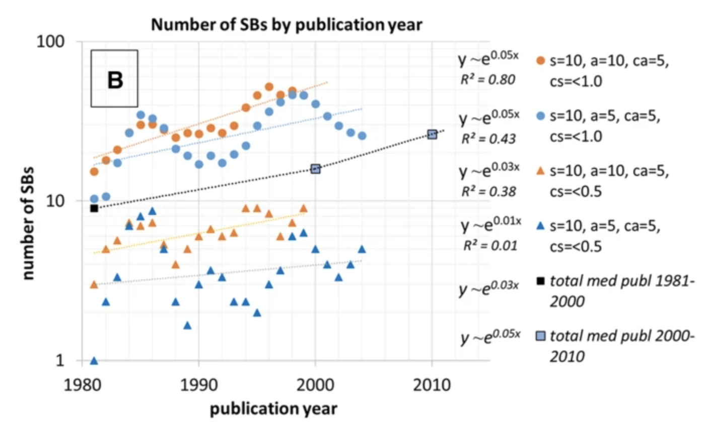

# なぜ重要な発見が最初に評価されないことがあるのか？

## 科学が原理的にそうだから
- 科学とは、変わらない世界に対する視点(パラダイム)の発展である。パラダイムの変化は科学革命によってもたらされるが、革命後の理論が既存のデータに十分適合するにはまた通常科学が必要なため、受け入れられるには1世代もかかることがある
    > Proust is just the man who might have been expected to achieve the Daltonian ratio.26 He was, that is, a fine experimentalist, and his view of the relation between mixtures and compounds was very close to Dalton’s. But it is hard to make nature fit a paradigm. That is why the puzzles of normal science are so challenging and also why measurements undertaken without a paradigm so seldom lead to any conclusions at all. Chemists could not, therefore, simply accept Dalton’s theory on the evidence, for much of that was still negative. **Instead, even after accepting the theory, they had still to beat nature into line, a process which, in the event, took almost another generation.** When it was done, even the percentage composition of wellknown compounds was different. The data themselves had changed. That is the last of the senses in which we may want to say that after a revolution scientists work in a different world.([The Structure of Scientific Revolution](https://press.uchicago.edu/ucp/books/book/chicago/S/bo13179781.html), P134)
    - コペルニクス、ニュートン、アインシュタイン
- 人間の心理的なもの(Resisted Discovery)、従来理論から若手の研究を否定しがち
    > [Resistance by Scientists to Scientific Discovery](https://www.science.org/doi/10.1126/science.134.3479.596)

## 主要な理論に反対するような意見だったから(Resistance)

> [Premature Discovery or Delayed Recognition - Why?](http://garfield.library.upenn.edu/essays/v4p488y1979-80.pdf)

## 著者の知名度が低かったから(Unknowned)

> [Premature Discovery or Delayed Recognition - Why?](http://garfield.library.upenn.edu/essays/v4p488y1979-80.pdf)

## 環境が変化したから(Premature)(外部環境の変化によって、昔大事だった価値観と今の価値観の変化や研究のあり方自体が変わった)

- 学術文献のindex化により、論文の中で見落としは少なくなり、研究室や企業向けの話に移っていった
    > [Premature Discovery or Delayed Recognition - Why?](http://garfield.library.upenn.edu/essays/v4p488y1979-80.pdf)
    
    - indexをつけるまでは良かった(本で探し、それをネットから取ってくるだけ)が、検索機能がつくことによって限られた領域の論文を読むことになり、すぐにコンセンサスを得られない論文は引用されにくくなってしまった
        - 実際に研究者が引用する領域は狭くなっている 
            > [Electronic Publication and the Narrowing of Science and Scholarship](https://www.science.org/doi/10.1126/science.1150473)
        - 一方で1970年以降、論文のAccessibilityが上がったことによってreferenceはより遅い論文を引用するようになっている
            > [A century of physics](https://www.nature.com/articles/nphys3494)
    - つまり、研究者の論文探索はより狭い領域を通時的に追うことが増えている（研究者の極端な専門化、それくらいしないと差別化できない)
    - 2000年以降Sleeping Beautyは少なくなっていることからも [Sleeping beauties gain impact in overdrive mode](https://link.springer.com/article/10.1007/s11192-021-03910-5)、遠すぎない他の分野によって発見されることが本当はSleeping Beautyに必要だったのではないか
        

- Serendipity(要サーベイ)

## 引用を確率モデリングした時に、確率的に必然で現れるから

- 論文数・参考文献数・ポアソン過程を考慮すると、fitnessが高い論文でも、arts&humanitiesで6.6%、その他の分野で3.3%は25年後にuncitedである。逆に9割以上はちゃんと低fitnessだから引用されていない(fitnessの分布がskewed) [Uncited papers are not useless](https://direct.mit.edu/qss/article/2/3/899/102769/Uncited-papers-are-not-useless)

## 所感
-  SBの研究は数あれど「どのようにSBは後に発見されているか」に定量的にアプローチした分析はまだない。これには周囲の論文との関係が大いにあるはず、その兆候をモデリングすることでSB他の眠ったままでいる研究と何が違うのかを明らかにする
