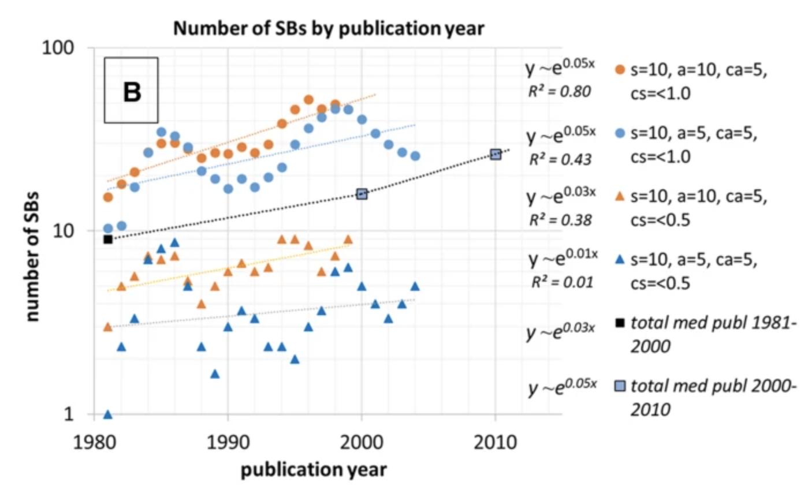

# Sleeping beautyはどれくらいあるのか？

- 非常に少ない
    - 最初の3年で被引用1以下かつ5年で被引用2以下の中で、20年後に被引用100を超えている論文は0.3% [Better late than never? On the chance to become highly cited only beyond the standard bibliometric time horizon](https://link.springer.com/article/10.1023/B:SCIE.0000006881.30700.ea)
    - 眼科ジャーナル全論文のうち、0.005% [Sleeping Beauties in ophthalmology](https://link.springer.com/article/10.1007/s11192-012-0667-z)
    - Innovation studiesでは全体の0.02% [Sleeping Beauties and their princes in innovation studies](https://link.springer.com/article/10.1007/s11192-016-2186-9)

- べき分布で表せるので、少なくない
    - [Defining and identifying Sleeping Beauties in science](https://www.pnas.org/doi/10.1073/pnas.1424329112)
        - > We observe a heterogeneous but continuous distribution of B, spanning several orders of magnitude. Except for the cutoff—which is much larger for the WoS dataset—APS and WoS exhibit remarkably similar distributions. Although the vast majority of papers exhibit low values of B, there is a consistent number of papers with high B. The distributions also show no typical value or mode; there are no clear demarcation values that allow us to separate SBs from “normal” papers: delayed recognition occurs on a wide and continuous range, in sharp contrast with previous results claiming that SBs are extraordinary cases (35, 37, 41).
    - [Exploring the “awakening effect” in knowledge diffusion: a case study of publications in the library and information science domain](https://www.sciencedirect.com/science/article/pii/S1751157722000943)

- 最近減っている
    - 2000年以降は減少傾向 [Sleeping beauties gain impact in overdrive mode](https://link.springer.com/article/10.1007/s11192-021-03910-5)
        
    

