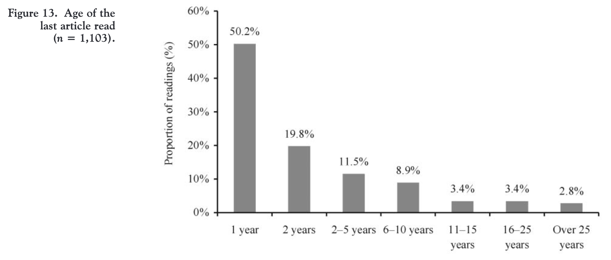
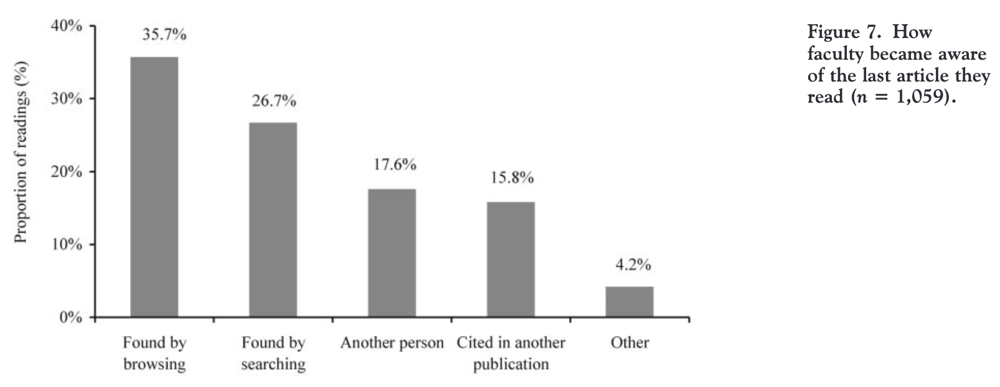
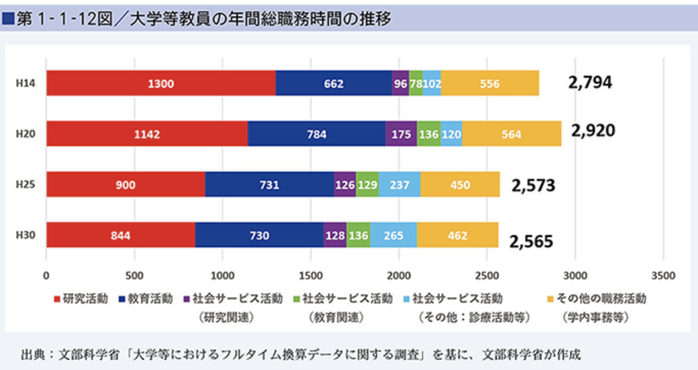
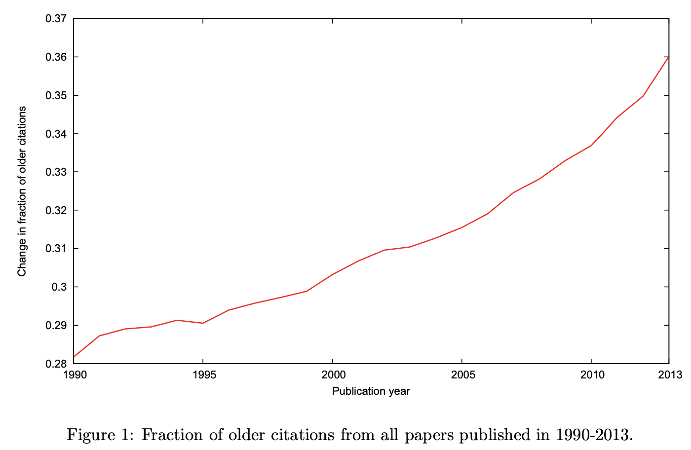

# なぜSleeping Beautyを見つけることは重要なのか？

## 大量の論文の中から自分の研究に関係ある論文を読むために、時間と引用を用いたスクリーニングがよく行われており、本来価値ある研究でもsleepしていると参照されない

- そもそも研究者は新しい論文をよく読み、古い論文はあまり読まない
    - [Scholarly journal information-seeking and reading patterns of faculty at five US universities, Fig.13](https://onlinelibrary.wiley.com/doi/abs/10.1087/2009208)
        -  
    - 引用文献の古さは指数分布に従う [The time dimension of science: Connecting the past to the future](https://www.sciencedirect.com/science/article/pii/S1751157717300020)
    - 月30本くらい読むので、古い論文は月1,2本読めば良い方 [論文数の増加がもたらした弊害, #論文が読みきれない](../rev4/README.md)

- また研究者は引用されている論文をよく読み、引用されていない論文をあまり読まない
    - 他の論文の引用に登場したから読むのは15.9% [Scholarly journal information-seeking and reading patterns of faculty at five US universities, Fig.7](https://onlinelibrary.wiley.com/doi/abs/10.1087/2009208)
        -  
    - 古典的にPreferential attachmentでよく近似できている。Barabasi
    - さらに引用されるだけでなく、「重要だ」と思われることも多い。次の研究への影響力が大きい [How status of research papers affects the way they are read and cited](https://www.sciencedirect.com/science/article/pii/S0048733322000129)

- さらに論文の数は爆発的に大きくなっている中で、サラミ出版・ハゲタカジャーナル・再現性の危機により質は保証されなくなってきていて[(論文数の増加がもたらした弊害)](../rev4/README.md)、新しく、被引用数が高く、有名誌に出るような論文以外は読む時間と体力がなくなってきている
    - (主観的に)有名誌以外は読まない、その中でも特に面白そうなもののみ。(吉田先生も言っていた、Dashunもトップ以外興味なし)
    - 日本では研究専従時間が減少しており、論文数伸びに対してキャッチアップが難しくなっている。研究パフォーマンスの制約についても、H30年時点では研究時間が76.4%で最多回答。 [文科省]((https://www.mext.go.jp/b_menu/hakusho/html/hpaa202201/1421221_00005.html))
        -  
        - ##TODO## 海外のエビデンスがあれば
    - ##TODO## 有名誌以外読まなくなっているというエビデンス
    -> だとしたら、SBの数は時代と共に減っていないとおかしい。でも増えてる。論文数に対しても増えてる？検索アルゴリズムの強化との相殺関係は？
    - 論文数が増えると、canonicalな論文が決まってごく少数のリーダーによってheterogeniousに先導されるものになってきている [Slowed canonical progress in large fields of science](https://www.pnas.org/doi/10.1073/pnas.2021636118)
        - なおさら、trivialな論文を読む時間はなくなる

- **なので、古くて、さらにまだ引用されてない論文なんて、忙しい今はなおさら読まない。時間と引用の二重パンチにさらに拍車がかかっている。**

## しかし、古くて引用されていない論文には、重要な価値が秘められている

- 古い論文の価値
    - citation hotspotには、少しの古い論文(Citation classic)が鍵 [The nearly universal link between the age of pastknowledge and tomorrow’s breakthroughs in scienceand technology: The hotspot](https://www.science.org/doi/10.1126/sciadv.1601315)
    - 2013年に投稿された論文のうち、36%は10年以上前のもの。[On the Shoulders of Giants: The Growing Impact of Older Articles](https://arxiv.org/pdf/1411.0275.pdf)
        > A team of researchers at Google has documented a surge in the citation rate for older papers. The study found that 36% of citations in 2013 were to papers that were at least 10 years old — a 28% increase since 1990. Scientists had a range of responses online. Carlos Baquero, a computer scientist at the University of Minho in Braga, Portugal, tweeted: “Older articles are now more accessible and thus their impact has grown. Knowledge escapes tyranny of time.”
        - 
            - **##TODO## これ自分で出した方が良い**
                - [Yian Yinの論文](https://www.sciencedirect.com/science/article/pii/S1751157717300020)だと10%くらいしか引用しないので、何かが違う。verstakは引用文化が違うEngineering, CSを外していることと、ある程度インパクトのあるジャーナルに絞っているようなのでそれが違いかも？

- 引用されていない論文の価値
    - 引用されていない論文のうち、数%は引用慣習的に見つかっていないだけ。inhomogenious poisson processで自然に起こる [Uncited papers are not useless]()
        - https://www.sciencedirect.com/science/article/pii/S1751157714000959?via%3Dihub
        - https://link.springer.com/article/10.1007/s11192-020-03539-w
        - https://elicit.org/search?q=Are+uncited+papers+should+be+read+compared+with+already+cited+papers%3F&token=01H861HQP1MPMGHW9SEGNRKR9E

- 科学の歴史的に、重要な発見は最初に受け入れられないことが多いため、現在眠っているSleeping Paperの中にも、科学を加速させるBeautyが眠っている可能性がある
    - 科学革命、rev1 1参照

- ##TODO## なぜCitation classicが大事なのか？最新論文にキャッチアップするより読む価値があるとなぜ入れるのか？

## 研究評価に短期の論文インパクトしか組み込まれていないため、発展まで時間のかかる研究を行う研究者を減らしてしまい、結果として科学の進歩が遅れていることが懸念されている

- 中国の研究評価システムでは、論文のインパクトを5年で決めている[Research on the Identification and Awakening of the Phenomenon of "Sleeping Beauty" in Educational Technology]()
- ##TODO## 小粒な研究が増えているのはどの国も同じなのか？体感、大きな研究室以外はどこもそう。インディアナでもそう。

## 
- Sleeping Beautyは、ユニークなknowledge diffusion patternの一種であり、knowledge difusionは分野の発展やイノベーションに必要である [Identifying keyword sleeping beauties: A perspective on the knowledge diffusion process]()

## 所感
- 今後発展しそうな内容、批判、他の研究とのつながりなど

日本以外の国も超トップ研究室以外小粒なイメージがあり、小粒なこと自体が問題というよりは「日本の小粒」がうまくいっていないことが問題なようにも思います。海外の小粒は小規模ながらも、ある程度期間が長いか社会が関心を寄せる問題意識に貢献するから良いと感じているのですが、「日本のような質の低い小粒の問題は評価が短期で規模が小さ過ぎるからだ」という言説はしっくりきますか。短期のプロジェクトでも成功する事例はありますが、長期のプロジェクトを特に推奨する理由はありますか。
予算規模の縮小・短期間の研究プロジェクトの推奨による、基礎研究体力の低下が特に指摘されることが多いですが、では長期のプロジェクトを増やしたら10年後くらいにはホームランは増えると思いますか。Sleeping beautyを探すことは、本当に研究力の向上に貢献するのでしょうか。