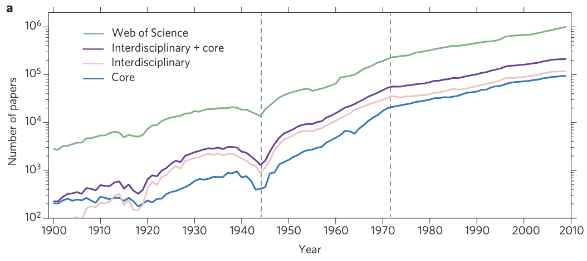
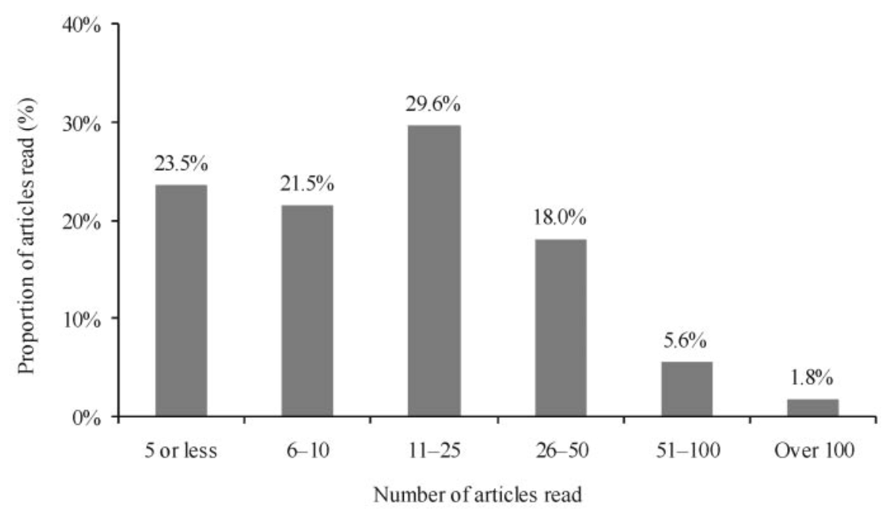
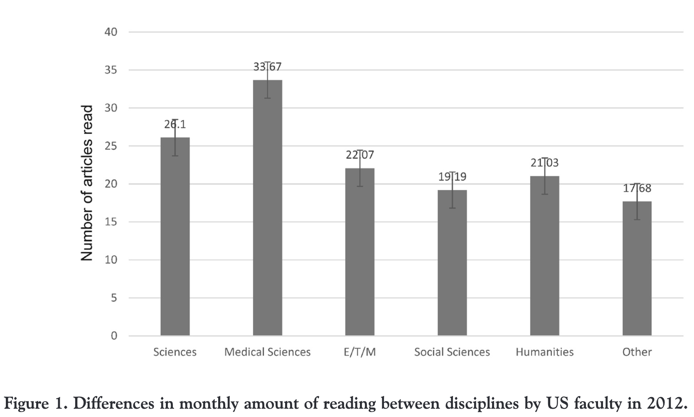
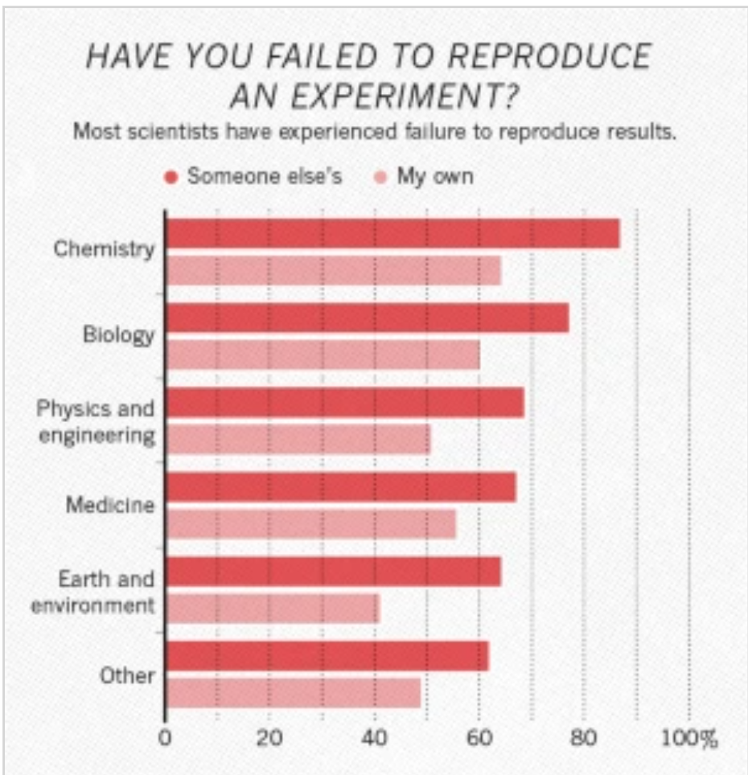
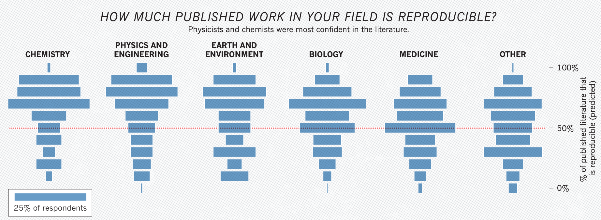

# 論文数の増加がもたらした弊害

## 論文数の増加のファクト
- 物理学では、世界大戦を除いて指数的に成長が続き、世界大戦後には6.5年で2倍になっていたが、1970年以降やや鈍化して18.5年で倍増になった。物理学の論文（物理ジャーナル+物理ジャーナルの論文をランダムより引用する論文）の割合は12%で横ばい。この上昇は、ほぼ著者数の増加によるものであり、さらに一人当たりの論文数はわずかに減っているので、チーム研究がとにかく増えている。
    > Throughout the history of physics, major paradigm shifts, such as the development of quantum physics, have spurred significant new research, resulting in a burst of publications and giving birth to new and enduring subfields, from nuclear to condensed-matter physics. The very existence of this growth is supported by the number of physics papers published each year (Fig. 1a), **which has been increasing roughly exponentially for the past 110 years, an expansion that was halted temporarily only by the two World Wars. Note, however, that the growth rate of physics is indistinguishable from the growth of science in general.** Hence, the field’s exponential growth is not driven by paradigm changes, but by societal needs, and capped by access to resources. ...This growth was particularly remarkable following World War II, when the physics literature doubled every 6.5 years. And yet, after 1970 this growth slowed, settling on its current rate of doubling every 18.7 years. Once again, the recent slowdown is not unique to physics, but characterizes the whole scientific literature contained in WoS. Finally, whereas pre-1910 physics literature was limited to physics journals, since the 1920s the growth of the core and interdisciplinary physics literature have been indistinguishable, indicating that publishing outside the physics core has been integral to the development of physics throughout the last century. [A century of physics, 2015](https://www.nature.com/articles/nphys3494)

    

## 論文が読みきれない

- 1ヶ月に読む論文は大体30本くらい
    - USの5大学(3つは博士に給与出せる研究大)のサーベイでは、平均22.6本/月(読み直し重複含む)、2割は読み直し。42.9%が精読、50.6%がメインの内容だけ、6.4%がアイデアだけ。平均33.1分で年130時間。 [Scholarly journal information-seeking and reading patterns of faculty at five US universities](https://onlinelibrary.wiley.com/doi/abs/10.1087/2009208)
        - 
        - 
        - 特にネイティブより非ネイティブはlanguage bareerがあり、2-3倍の時間がかかる[The manifold costs of being a non-native English speaker in science](https://journals.plos.org/plosbiology/article?id=10.1371/journal.pbio.3002184)

- ##TODO## 1ヶ月に自分の領域で出る論文はX本 -> 30本では読みきれない。絞るしかない

## 研究の質の低下

- 儲かることを一義としたハゲタカジャーナルが登場し、質の低い論文が増えている
    - ペーパーミルをする非現実的な論文が何百も受け入れられている。MOF+医療応用。被引用すら、ブローカーによる引用交換が行われてお互いを引用し合う歪な状態になっている [What makes an undercover science sleuth tick? Fake-paper detective speaks out](https://www.nature.com/articles/d41586-022-02099-8)
    - 著者名を買うだけで論文が出せる [Multimillion-dollar trade in paper authorships alarms publishers](https://www.nature.com/articles/d41586-023-00062-9)。WoSやScopusに載ってれば良いのか、いたちごっこ。
        - 価格は数百ドルから数千ドル、ある雑誌では何億円もの市場になっていた
        > In a preprint1 posted on the arXiv server in December 2021, Abalkina describes an analysis of more than 1,000 authorship offers, together worth more than US$6.5 million, published in 2019–21 on a Russian-language website called International Publisher. She has now linked 460 published papers to the adverts. (International Publisher did not respond to Nature’s request for comment.)

    - これにより研究費が出版費で消え、科学の進展を妨げている

- 再現可能な論文が減っている
    - 科学者の52%が、現在を"再現性の危機"と認識している。他人の研究が再現できなかった経験はどの分野も6割以上あり、自身の研究すら半数程度は再現しないことを経験したことがある。特に、化学・物理学以外の論文は50%程度再現しないこともある。 [1,500 scientists lift the lid on reproducibility](https://www.nature.com/articles/533452a)
    -  
    - 

- disruptiveな論文が減っている
    - [Papers and patents are becoming less disruptive over time](https://www.nature.com/articles/s41586-022-05543-x)
    > 

## 評価基準の信頼性の低下

- 論文や被引用数で業績が評価されるため、ホームランより小さな大量の貢献を欲し、不正に論文を増やす原因になっている
- 研究費も論文数や被引用数での評価になり、獲得競争も激化したため、不正に論文を増やす原因になっている

## 研究者への不信感の増大

## 若手研究者の出版プレッシャー

- 再現可能で無い論文を書く理由の第二位が出版プレッシャー [1,500 scientists lift the lid on reproducibility](https://www.nature.com/articles/533452a)

## Awesome

- [ペーパーミル問題：科学界の真実とその影響](https://www.chem-station.com/blog/2023/04/papermill.html)
    - [Multimillion-dollar trade in paper authorships alarms publishers](https://www.nature.com/articles/d41586-023-00062-9)
    - [What makes an undercover science sleuth tick? Fake-paper detective speaks out](https://www.nature.com/articles/d41586-022-02099-8)

## 所感
- ハゲタカ誌の問題は、倫理観のない研究者と倫理観の無いビジネスのマッチングで発生するので、①ハゲタカをした人を追放レベルで厳しく追求する②ハゲタカジャーナルを徹底的に潰す③ハゲタカでは無い正当な貢献をする研究を正しく評価する、の3択を選ぶしか無い。政府としては、ハゲタカ誌をいくら潰しても、研究者が出版プレッシャーから逃れない限りもぐら叩きなので、バント100本よりホームラン1本を推奨するようにするのが良いのでは。

- 今後発展しそうな内容、批判、他の研究とのつながりなど