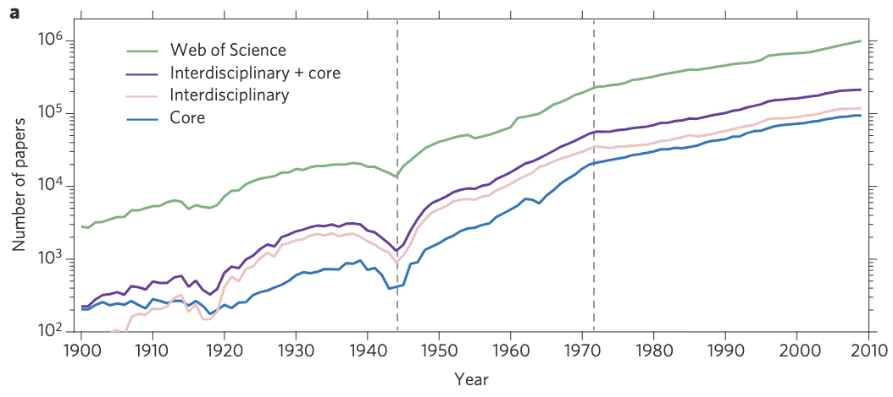

# 論文数の増加がもたらした弊害

## 論文数の増加のファクト
- 物理学では、世界大戦を除いて指数的に成長が続き、世界大戦後には6.5年で2倍になっていたが、1970年以降やや鈍化して18.5年で倍増になった。物理学の論文（物理ジャーナル+物理ジャーナルの論文をランダムより引用する論文）の割合は12%で横ばい。この上昇は、ほぼ著者数の増加によるものであり、さらに一人当たりの論文数はわずかに減っているので、チーム研究がとにかく増えている。

    > Throughout the history of physics, major paradigm shifts, such as the development of quantum physics, have spurred significant new research, resulting in a burst of publications and giving birth to new and enduring subfields, from nuclear to condensed-matter physics. The very existence of this growth is supported by the number of physics papers published each year (Fig. 1a), **which has been increasing roughly exponentially for the past 110 years, an expansion that was halted temporarily only by the two World Wars. Note, however, that the growth rate of physics is indistinguishable from the growth of science in general.** Hence, the field’s exponential growth is not driven by paradigm changes, but by societal needs, and capped by access to resources. This growth was particularly remarkable following World War II, when the physics literature doubled every 6.5 years. And yet, after 1970 this growth slowed, settling on its current rate of doubling every 18.7 years. Once again, the recent slowdown is not unique to physics, but characterizes the whole scientific literature contained in WoS. Finally, whereas pre-1910 physics literature was limited to physics journals, since the 1920s the growth of the core and interdisciplinary physics literature have been indistinguishable, indicating that publishing outside the physics core has been integral to the development of physics throughout the last century.
    > The literature published in physicsjournals went from representing around 4%of the scientific literature in 1945 to about10% after 1980, and has been approximatelysteady since then (Fig. 1b). Interdisciplinaryphysics has followed a similar pattern,growing from 6% in 1945 to a maximumof 18% in 1964, and stabilizing at 12% after 1980. The wider physics literature representsaround 22% of all scientific literaturesince the 1980s, a remarkable fractionthat documents the profound role andembeddedness of physics within the largerscientific enterprise.Is the exponential growth of the physicsliterature driven by an exponential growthin the number of physicists, or by graduallyincreasing productivity? To answer thisquestion, we used the disambiguatedauthorships of papers published by theAmerican Physical Society (ref. 13 and Sinatra et al., manuscript in preparation),finding that the number of authors has increased at the same rate as the number of papers (Fig. 1c). **This leads us to conclude that the growth of physics literature is driven solely by the increasing number of authors.** We do observe, however, nontrivial shifts in productivity. Indeed, whereas before 2000, a typical physicist co-authored fewer than one publication per year, in the past 15 years, the number of papers co-authored by each physicist jumped above one for the first time (Fig. 1d, black curve). Yet, this remarkable growth in productivity did not boost the field’s overall productivity(Fig. 1c), as the total papers-per-author ratio dropped slightly (Fig. 1d, red curve). This indicates that the observed singular growth in individual productivity has its origins incollaborative effects: although on average each physicist continues to write fewer than one paper (Fig. 1a), she/he ends up as co-author of multiple publications. In other words, during the past decade, collaborative work has significantly boosted individual productivity when measured as whole paper counts14,15, while leaving the field’s overall productivity unchanged. [A century of physics, 2015](https://www.nature.com/articles/nphys3494)

    

## 所感
- 今後発展しそうな内容、批判、他の研究とのつながりなど